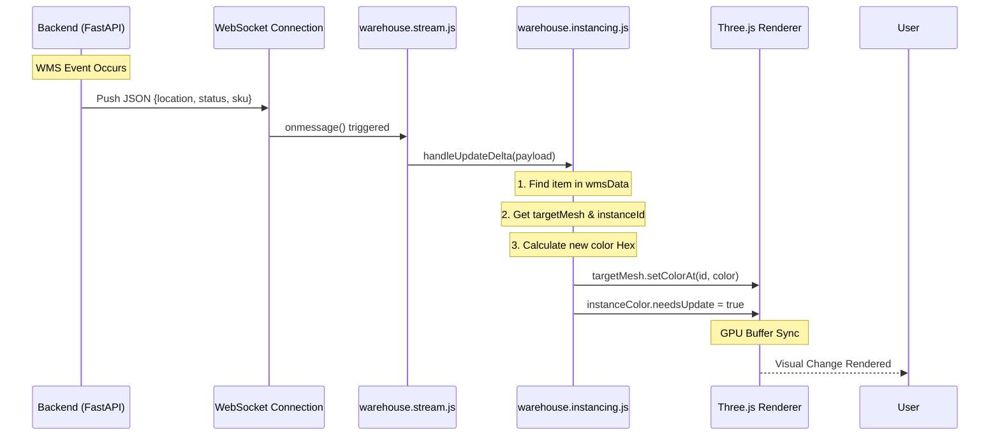

# Data Flow Architecture

The following diagram illustrates the lifecycle of a real-time data update, flowing from the Backend generator to the internal Three.js GPU buffers.

## Key Mechanisms
1. **Push over Pull**: The frontend never requests updates; it subscribes to the persistent WebSocket and reacts purely to pushed JSON.
2. **Buffer Mutation**: We do not destroy or recreate 3D objects. When status changes from `OCCUPIED` to `EMPTY`, the `warehouse.instancing.js` script simply overwrites the specific index within the InstancedMesh's color Float32Array and flags it for GPU upload.
