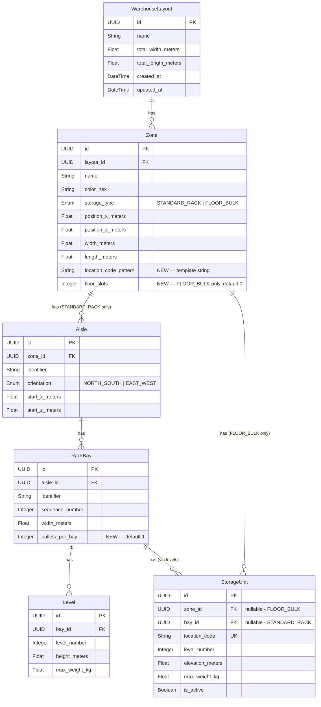

# Data Model: 2D Warehouse Builder

**Feature**: 003-2d-warehouse-builder  
**Date**: 2026-03-09

## Entity Relationship Diagram



## Schema Changes (Diff from Current)

### Zone — 2 new columns

| Column | Type | Default | Purpose |
|--------|------|---------|---------|
| `location_code_pattern` | String(255) | `"{zone_name}-A{aisle:02d}-B{bay:03d}-L{level}"` | Template for generating location codes from hierarchy |
| `floor_slots` | Integer | `0` | Number of floor storage positions (FLOOR_BULK only) |

### RackBay — 1 new column

| Column | Type | Default | Purpose |
|--------|------|---------|---------|
| `pallets_per_bay` | Integer | `1` | How many pallets fit side-by-side in one bay at each level |

## Validation Rules

- `WarehouseLayout.name`: Required, 1-255 chars, unique per account
- `Zone.position_x + Zone.width <= Layout.total_width`: Zone must fit inside footprint
- `Zone.position_z + Zone.length <= Layout.total_length`: Zone must fit inside footprint
- `Zone.location_code_pattern`: Must be a valid template string with recognized variables
- `RackBay.pallets_per_bay`: 1-6 range
- `Zone.floor_slots`: 0-500 range
- Generated `StorageUnit.location_code`: Must be unique across the entire layout

## Generated Location Code Examples

Given pattern `E01-{aisle:02d}-{bay:03d}` on a zone with 2 aisles, 3 bays, 2 levels, 1 pallet/bay:

```
E01-01-001-L0    E01-01-002-L0    E01-01-003-L0
E01-01-001-L1    E01-01-002-L1    E01-01-003-L1
E01-02-001-L0    E01-02-002-L0    E01-02-003-L0
E01-02-001-L1    E01-02-002-L1    E01-02-003-L1
```

Given pattern `BULK-{slot:03d}` on a FLOOR_BULK zone with 20 slots:

```
BULK-001  BULK-002  BULK-003  ...  BULK-020
```
